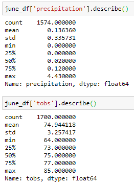
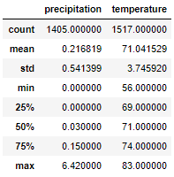

# surfs_up

## Summary
Performed exploratory climate analysis for Oahu, Hawaii to determine weather patterns and their potential affects on a surf and ice cream shop business. 

Determined weather patterns by writing queries that referenced the hawaii.sqlite database containing yearly weather information gathered from multiple weather stations. In addition, a Flask weather app (app.py) was set up to share the results via a webpage. 

## Challenge Assessment
One of the main concerns for establishing a surf and ice cream shop is whether or not certain times of the year will be better or slower for business. The key statistical data for the months of June and December have been analyzed and the results are displayed below:

June Statistics: 

December Statistics:

## Recommendations

