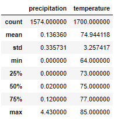

# surfs_up

## Summary
Performed exploratory climate analysis for Oahu to assess weather patterns and their potential affects on a surf and ice cream shop business. 

Weather patterns were determined by writing queries that referenced the hawaii.sqlite database containing yearly weather information gathered from multiple weather stations. In addition, a Flask weather app (app.py) was set up to share the results via a webpage. 

## Challenge Assessment
One of the main concerns for establishing a surf and ice cream shop is whether or not certain times of the year will be better or slower for business. For example, summer months may have better weatehr than the winter months. Therefore, the key statistical data for the months of June and December have been analyzed and the results are displayed below:

June Statistics: 

December Statistics:

The key statistics analysis calculates the mean, standard deviation, minimum and maximum values, percentiles, and count; precipitation (prcp) is in total inches and temperature (tob) is the temperature observed in degrees fahrenheit. From a quick glance at the data, it is observed that on average, there is less rain and higher temperatures during the month of June. However, with the data displayed, there is not much disparity between the two months. The temperature is in the 70's during the June and December with max temperatures in the 80's, and average amount of precipitation jumps from about 0.14 inches to 0.22 inches. 

## Recommendations for Further Analysis
I would recemmond calculating the number of days that it rained each month in addition to the amount rained. Although some months may have had more rain, the data could have been skewed by a couple of days of heavy rain. If it is raining more days out of certain months, people may be less inclined to surf during those months. To help support the additional analysis, I would also recommend constructing histograms for the targeted months, such as June and December, to visualize the number of observations for certain levels of rainfall. 

For next steps, I would also begin to consider where on Oahu the shop would be best located. The weather data was gathered from different stations across the island. Some parts of the island may have better weather than the other locations. A key statistical weather analysis can be made for each of the 9 stations, and then compared. As well as, the number of observations made by each station can be reviewed. Before relying solely on the statistical data, it is important to make sure that sufficient and accurate data is being used; maybe one of weather stations is new or data was not being gathered due to issues experienced by the station. These are all possibilities that need to be considered before proceeding with building the surf and ice cream shop. 
